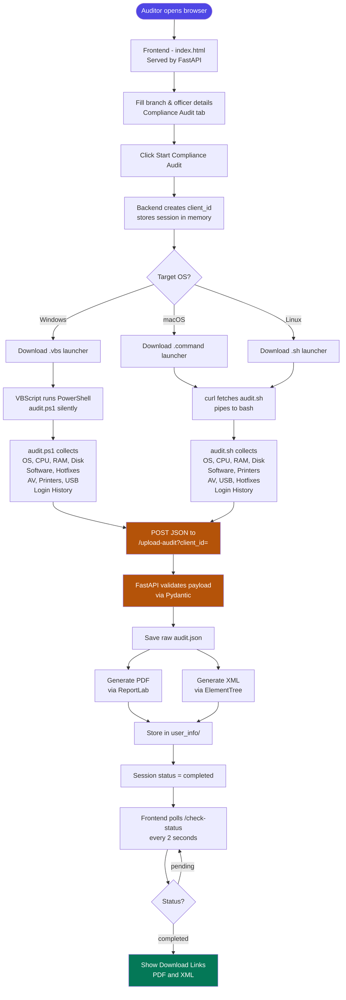
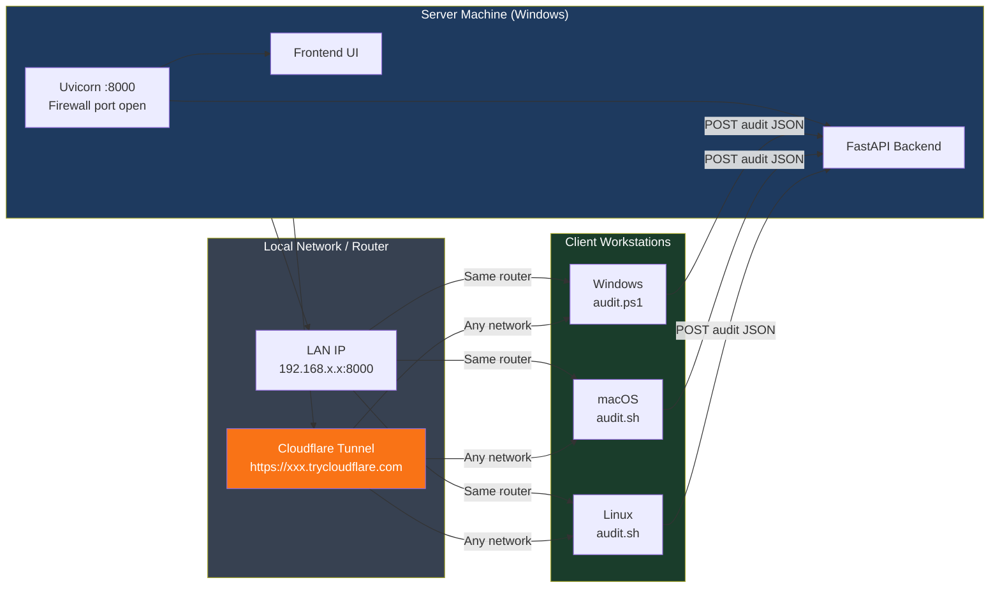
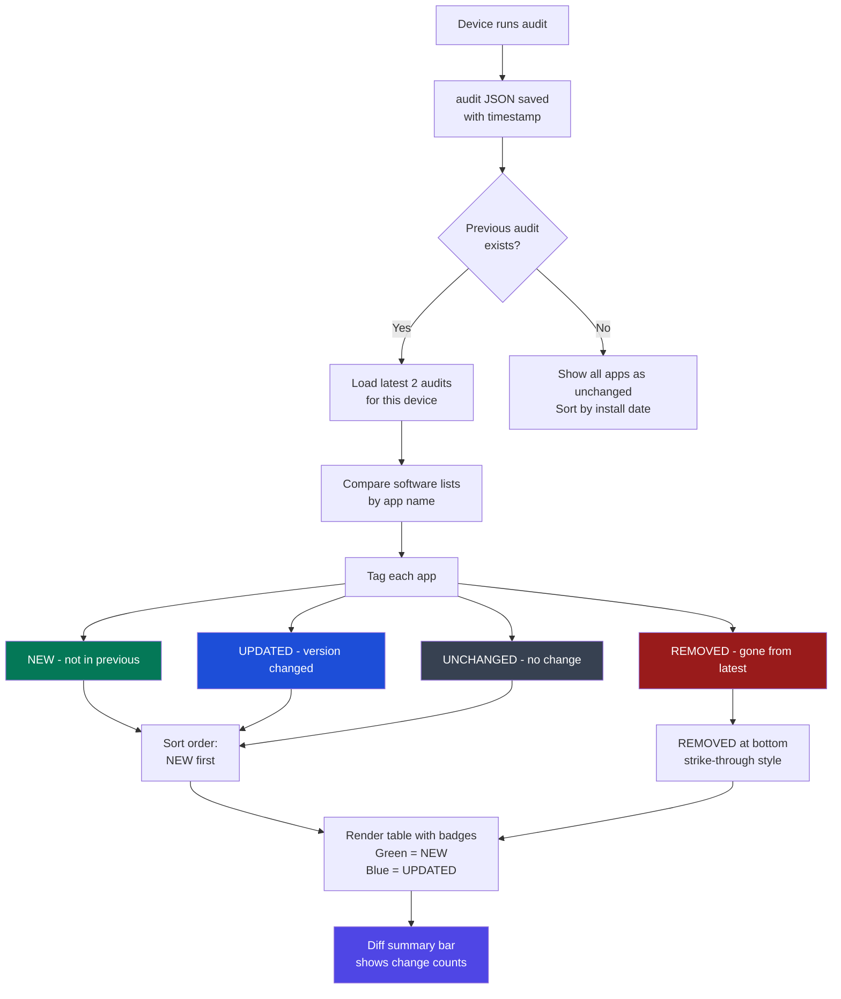

# Infrapulse — NSDL IT Asset Management Portal

A workstation compliance audit tool for NSDL branch offices. Collects IT asset and system information from Windows, macOS, and Linux workstations and generates PDF + XML audit reports.

---

## Tech Stack

| Layer | Technology | Role |
|-------|-----------|------|
| ⭐ **Backend Framework** | [FastAPI](https://fastapi.tiangolo.com/) | Core API server — routes, data validation, report generation |
| ⭐ **ASGI Server** | [Uvicorn](https://www.uvicorn.org/) | Serves FastAPI, auto-reload, LAN binding on `0.0.0.0` |
| ⭐ **Data Validation** | [Pydantic v2](https://docs.pydantic.dev/) | Validates all incoming audit JSON payloads |
| ⭐ **PDF Generation** | [ReportLab](https://www.reportlab.com/) | Builds the compliance PDF report with tables and branding |
| **XML Generation** | Python `xml.etree.ElementTree` | Builds structured XML audit export |
| ⭐ **Frontend** | Vanilla JS + HTML/CSS | Single-page UI, no framework — zero build step |
| **Windows Audit** | PowerShell (`audit.ps1`) | Collects full system data via WMI/registry on Windows |
| ⭐ **Mac/Linux Audit** | Bash + Python3 (`audit.sh`) | Cross-platform data collection via system commands |
| **Network Scanning** | Python `socket` + `ipaddress` | TCP port scan with ARP fallback for device discovery |
| **WiFi** | `netsh` / `airport` / `nmcli` | Platform-specific WiFi scan and connect |
| **Concurrency** | `concurrent.futures.ThreadPoolExecutor` | Parallel port scanning across /24 subnets |
| **Tunneling** | [Cloudflare Tunnel](https://developers.cloudflare.com/cloudflare-one/connections/connect-networks/) | Expose local server publicly for remote audits |

> ⭐ = plays a major role in core functionality

---

## System Flow



---

## Network Flow (LAN / Broadband)



---

## Audit Data Flow (Incremental Diff)



---

## Project Structure

```
prevo-inspection/
├── backend/
│   ├── main.py              # FastAPI application (all API routes)
│   └── requirements.txt     # Python dependencies
├── frontend/
│   └── index.html           # Single-page UI (vanilla JS, no framework)
├── scripts/
│   ├── audit.ps1            # Windows PowerShell audit script
│   └── audit.sh             # macOS / Linux bash audit script
├── user_info/               # Generated audit JSON, PDF, XML reports
├── logs/                    # Backend log file
└── venv/                    # Python virtual environment (created locally)
```

---

## Requirements

- Python 3.10 or higher
- pip

---

## Setup & Running

### 1. Clone the repository

```bash
git clone https://github.com/TR0J49/prevo-inspection.git
cd prevo-inspection
```

### 2. Create a virtual environment

**Windows**
```bash
python -m venv venv
```

**macOS / Linux**
```bash
python3 -m venv venv
```

### 3. Activate the virtual environment

**Windows**
```bash
venv\Scripts\activate
```

**macOS / Linux**
```bash
source venv/bin/activate
```

### 4. Install dependencies

```bash
pip install -r backend/requirements.txt
```

### 5. Start the server

```bash
uvicorn backend.main:app --host 0.0.0.0 --port 8000 --reload
```

On startup you will see your network URL printed automatically:

```
======================================================
  Infrapulse - NSDL IT Asset Management Portal
======================================================
  Local   : http://localhost:8000
  Network : http://192.168.x.x:8000   <-- share this with client machines
------------------------------------------------------
  macOS : right-click .command -> Open, or run:
    bash verify_system_<id>.command
  Linux : run with:
    bash verify_system_<id>.sh
======================================================
```

> Open the frontend using the **Network URL** (not localhost) so audit scripts on client machines get the correct server address injected automatically.

---

## Running an Audit

1. Open the app in your browser using the **Network IP** shown on startup
2. Go to the **Compliance Audit** tab
3. Fill in branch and officer details
4. Click **Start Compliance Audit** — a launcher script will be downloaded
5. Run the downloaded script on the target workstation:
   - **Windows** — run the `.vbs` file (launches PowerShell silently)
   - **macOS** — run: `bash verify_system_<id>.command`
   - **Linux** — run: `bash verify_system_<id>.sh`
6. The frontend polls for completion every 2 seconds
7. Download the generated **PDF** or **XML** report once complete

---

## LAN / Firewall Notes

| Issue | Solution |
|-------|---------|
| Windows Firewall blocks port 8000 | Auto-added on startup as `Infrapulse Port 8000` rule. Run server as Administrator if it fails |
| macOS Gatekeeper blocks `.command` | Run with `bash verify_system_<id>.command` instead of double-clicking |
| Client on different network | Use Cloudflare Tunnel: `cloudflared tunnel --url http://localhost:8000` |
| curl not installed (Linux) | Script falls back to `wget` automatically |
| Server unreachable | Script checks TCP connection first and prints a clear error with cause |

---

## Exposing via Cloudflare Tunnel

For cross-network audits (different router / broadband / remote site):

**Terminal 1 — Server**
```bash
venv\Scripts\activate
uvicorn backend.main:app --host 0.0.0.0 --port 8000 --reload
```

**Terminal 2 — Tunnel**
```bash
cloudflared tunnel --url http://localhost:8000
```

Open the frontend via the `https://xxxx.trycloudflare.com` URL so that URL is injected into audit scripts.

---

## Tabs Overview

| Tab | Description |
|-----|-------------|
| Compliance Audit | Run audits, download launcher scripts, get PDF/XML reports |
| Asset Registry | Register, edit, and delete IT assets with lifecycle tracking |
| Network Discovery | TCP port scan any CIDR range with ARP fallback for mobile/firewalled devices |
| Device Audits | Browse hardware specs, software inventory, and incremental change diff per device |
| WiFi Dashboard | Scan nearby WiFi networks, connect, and discover devices on the subnet |

---

## API Endpoints (Quick Reference)

| Method | Endpoint | Description |
|--------|----------|-------------|
| `GET` | `/check-status?client_id=` | Poll audit completion status |
| `GET` | `/download-vbs?client_id=` | Download Windows VBS launcher |
| `GET` | `/download-mac?client_id=` | Download macOS .command launcher |
| `GET` | `/download-linux?client_id=` | Download Linux .sh launcher |
| `POST` | `/upload-audit?client_id=` | Submit audit data, generate PDF + XML |
| `GET` | `/download-report?client_id=&format=pdf\|xml` | Download generated report |
| `GET` | `/api/devices` | List all audited devices |
| `GET` | `/api/software/{computer_name}` | Get software inventory with incremental diff |
| `POST` | `/discover/network-scan` | Scan a CIDR range for live hosts |
| `GET` | `/wifi/networks` | List nearby WiFi networks |
| `GET` | `/wifi/current` | Get current WiFi connection info |
| `POST` | `/wifi/connect` | Connect to a WiFi network |
| `POST` | `/asset-metadata` | Save an asset record |
| `GET` | `/assets` | List all asset records |

---

## Restarting After Setup

**Windows**
```bash
venv\Scripts\activate
uvicorn backend.main:app --host 0.0.0.0 --port 8000 --reload
```

**macOS / Linux**
```bash
source venv/bin/activate
uvicorn backend.main:app --host 0.0.0.0 --port 8000 --reload
```
