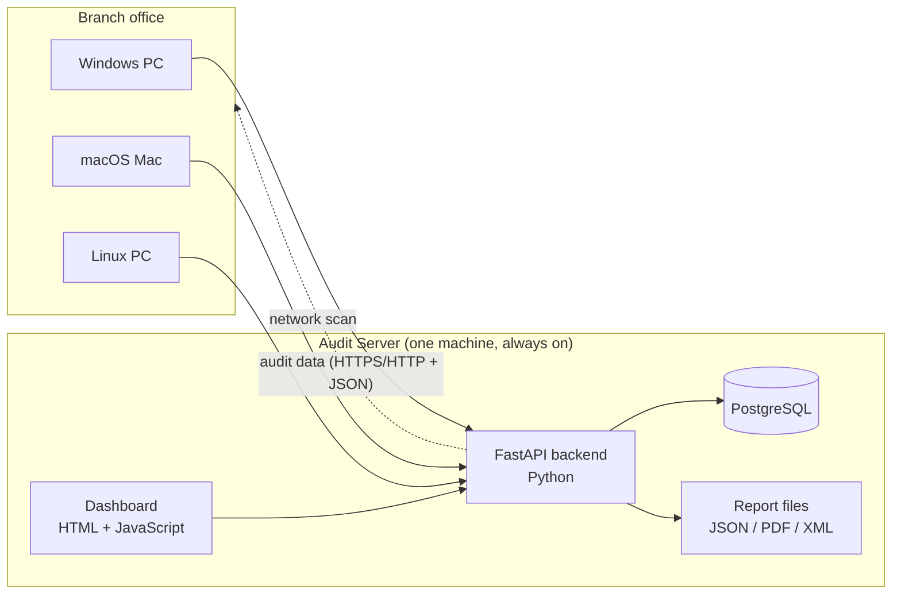
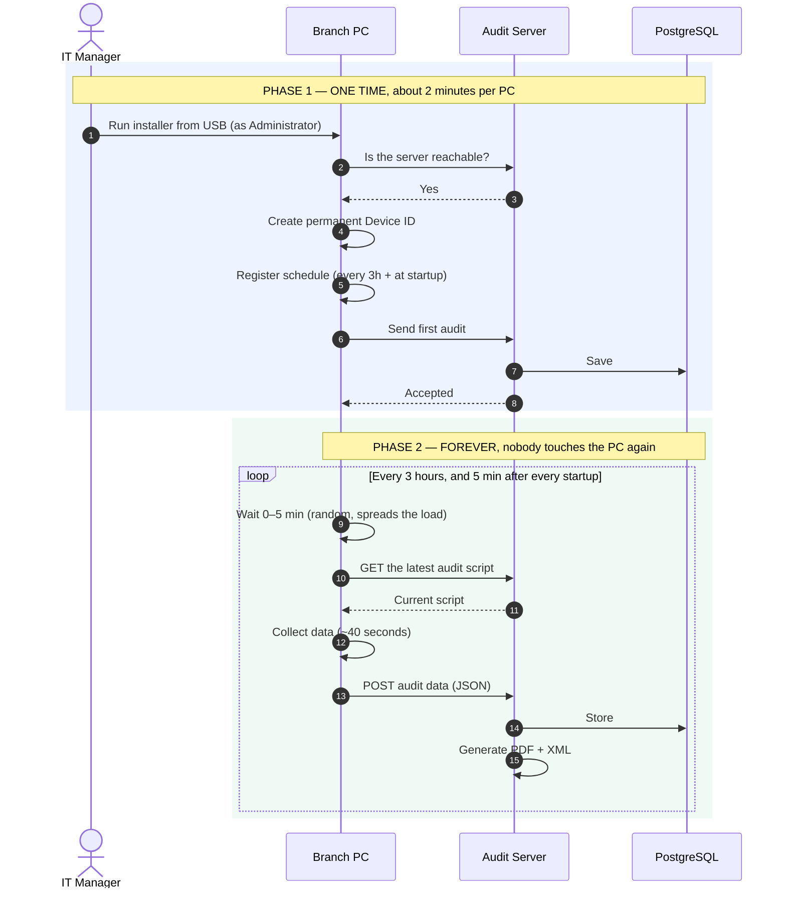
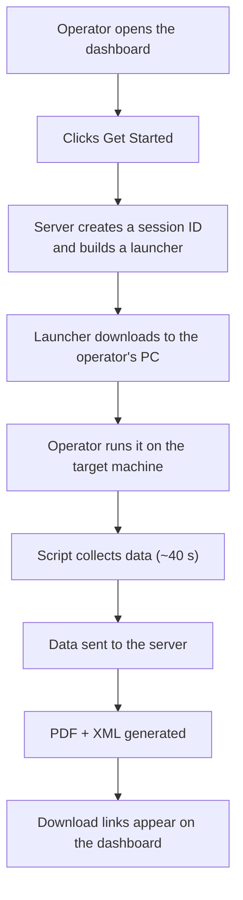
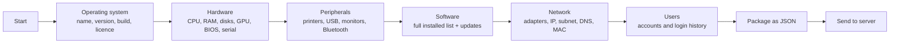
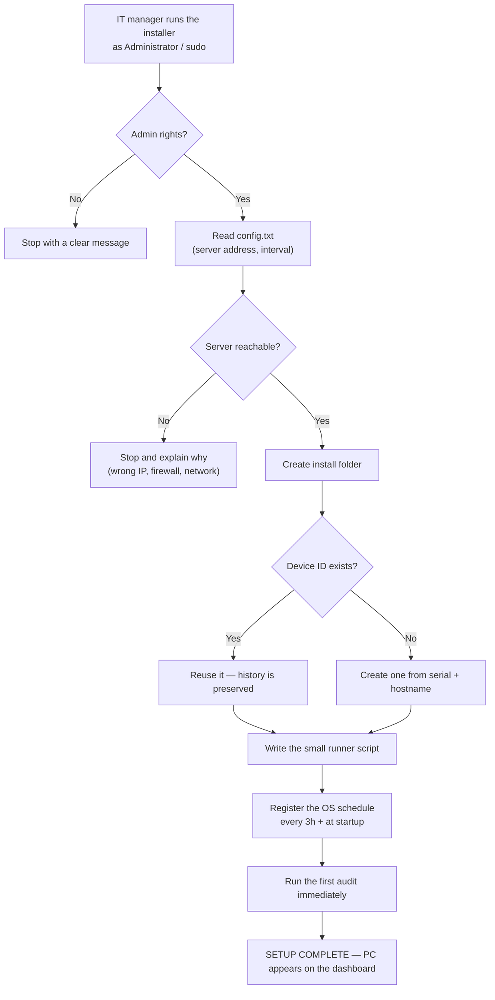
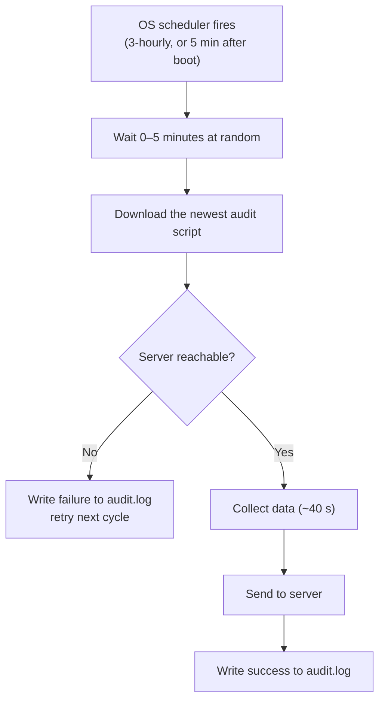
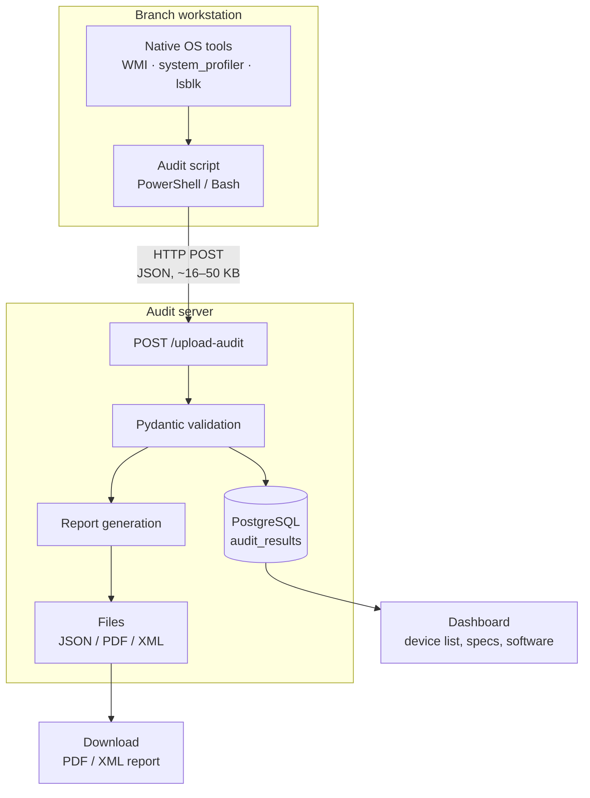
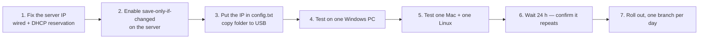

# Infrapulse — Workstation Compliance Audit System

**Complete project & workflow documentation**

---

## 1. What this project is

Infrapulse is a system that answers one question for every computer in an NSDL
branch office:

> *"What exactly is on this machine, and is it compliant?"*

It collects a complete picture of each workstation — hardware, installed
software, printers, storage, network settings, user accounts and login history —
and turns it into an audit-ready **PDF** and **XML** report.

### The problem it solves

| Before | With Infrapulse |
|---|---|
| Someone visits each PC and notes details by hand | The PC reports itself |
| Records go out of date immediately | Refreshed every 3 hours automatically |
| No proof of what changed, or when | Full history, with change comparison |
| Reports assembled manually in Excel | PDF + XML generated instantly |
| No visibility of unknown devices on the LAN | Network scan finds every device |

### Two ways to run an audit

1. **On-demand** — open the dashboard, click *Get Started*, run the launcher on
   the target PC. Good for a one-off check.
2. **Automatic (recommended)** — install a small agent once per PC from a USB
   stick. That PC then audits itself **every 3 hours and at every startup**,
   forever, with nobody touching it.

---

## 2. The system at a glance



**One server. Many workstations.** The workstations always start the
conversation — the server never needs to reach into a PC (except for the
optional remote-audit feature).

---

## 3. Technology used, and why

### Server side

| Technology | Purpose | Why this one |
|---|---|---|
| **Python 3.11** | Language for the whole backend | Excellent library support for system data and reports |
| **FastAPI** | Web framework — serves the API and dashboard | Fast, automatic input validation, self-documenting |
| **Uvicorn** | The web server that runs FastAPI | Lightweight, production-capable, single command to start |
| **Pydantic** | Validates every incoming audit | Rejects malformed data before it reaches the database |
| **PostgreSQL** | Stores audit history and sessions | Reliable, handles JSON natively (JSONB), proven at scale |
| **psycopg2** | Connects Python to PostgreSQL | Standard, well-tested driver with connection pooling |
| **ReportLab** | Generates the PDF report | Full control over layout, tables and page furniture |
| **xml.etree** (built-in) | Generates the XML report | Machine-readable output for other NSDL systems |
| **python-dotenv** | Reads database settings from `.env` | Keeps passwords out of the source code |

### Client side (the workstations)

| Technology | Purpose | Why this one |
|---|---|---|
| **PowerShell + WMI/CIM** | Collects data on Windows | Built into every Windows PC — nothing to install |
| **Bash + system tools** | Collects data on macOS & Linux | Built in — `system_profiler`, `diskutil`, `lsblk`, `lspci`, `dmidecode` |
| **Python 3** (on Mac/Linux) | Formats collected data as JSON | Pre-installed on macOS and virtually all Linux |
| **Task Scheduler** (Windows) | Runs the audit every 3 hours | Native OS scheduler — survives reboot, needs no service |
| **launchd** (macOS) | Same, for Mac | Native macOS scheduler |
| **systemd timer** (Linux) | Same, for Linux | Native, and catches up runs missed while switched off |

### Dashboard

| Technology | Purpose | Why this one |
|---|---|---|
| **HTML + CSS + vanilla JavaScript** | The entire user interface | No build step, no framework, no dependencies — one file that always works |
| **Mermaid** | Diagrams in documentation | Renders directly on GitHub |

### Optional remote features

| Technology | Purpose |
|---|---|
| **paramiko** | Triggers an audit on a Mac/Linux machine over SSH |
| **pywinrm** | Triggers an audit on a Windows machine over WinRM |
| **pypsexec / smbprotocol** | Fallback remote execution over SMB |

> **Deliberate choice:** everything on the workstation uses tools that are
> *already part of the operating system*. Nothing has to be installed on a branch
> PC — no runtime, no agent framework, no third-party software.

---

## 4. End-to-end workflow

### 4.1 The automatic (agent) workflow — the main one



**The key idea:** the PC *pulls* a fresh copy of the script on every run. Fix
something once on the server and every workstation picks it up automatically —
you never revisit the machines.

### 4.2 The on-demand workflow



### 4.3 What happens during a single audit



Typical duration: **30–60 seconds**. The heaviest step is the software
inventory, which reads the full installed-programs list.

---

## 5. How the installer works, step by step

This is what happens when the IT manager runs `Install-Audit.bat` (Windows),
`install-audit.command` (Mac) or `install-audit.sh` (Linux).



### What gets left on the machine

| | Windows | macOS | Linux |
|---|---|---|---|
| Folder | `C:\ProgramData\NSDLAudit\` | `/Library/Application Support/NSDLAudit/` | `/var/lib/nsdl-audit/` |
| `device.id` | permanent machine identity | same | same |
| `config.txt` | server address & interval | same | same |
| `run-audit.ps1` / `.sh` | the small runner | same | same |
| `audit.log` | what happened, when | same | same |
| Schedule | Task Scheduler → *NSDL Compliance Audit* | `com.nsdl.audit` LaunchDaemon | `nsdl-audit.timer` |

Total footprint: **under 20 KB**. No service, no background process sitting in
memory — the OS scheduler wakes the script only when it is due.

### Why a "Device ID"?

An automatic schedule has no browser session. Each PC therefore gets a permanent
ID (for example `dev_92ad241d47d8`), derived from its serial number and hostname
and saved to disk. Every future audit sends the same ID, so the server knows
*"this is the same machine as before"* and can keep its history and show what
changed. Re-running the installer reuses the existing ID, so history is never
broken.

### What runs every 3 hours



The random delay matters: without it, fifty PCs in a branch would all contact
the server at the same instant every three hours.

It runs as **SYSTEM** (Windows) or **root** (Mac/Linux), so it works with nobody
logged in, and continues after logoff or reboot.

---

## 6. Data flow



### What is collected

**About the machine**

| Group | Examples |
|---|---|
| Operating system | name, version, build, service pack, licence status |
| Device | type (laptop/desktop), manufacturer, model, serial, asset tag |
| Processor & memory | CPU model, cores, RAM, slot count, current & maximum size |
| Storage | each disk, size, free space, file system, SSD or HDD |
| Firmware | BIOS version and date |
| Uptime | boot time, uptime, last shutdown, last backup |

**About what is attached and installed**

| Group | Examples |
|---|---|
| Printers | name, port, status, local or network |
| Peripherals | keyboard, mouse, camera, audio, Bluetooth |
| Connected devices | anything on USB, PCI, HDMI, serial ports |
| Graphics | GPU model and driver version |
| Software | complete installed list, versions, install dates |
| Updates | installed patches and hotfixes |
| Security | antivirus products detected |

**About the network and users**

| Group | Examples |
|---|---|
| Network | adapters, IPv4/IPv6, subnet mask, gateway, DNS, MAC |
| Users | local accounts, home folders, last login, admin rights |
| Login history | recent sign-ins |

### What is **never** collected

> The audit reads **system inventory only**. It never opens documents,
> spreadsheets, email, photos, browser history or any personal file. It records
> *that* software is installed, never what is inside a user's files.

### Where data is stored

| Location | Contents | Retention |
|---|---|---|
| PostgreSQL `audit_results` | every audit as JSONB, searchable | full history |
| PostgreSQL `sessions` | audit session state | full history |
| `user_info/*.json` | raw payload as received | kept on disk |
| `user_info/*.pdf` | formatted compliance report | kept on disk |
| `user_info/*.xml` | machine-readable report | kept on disk |

---

## 7. Protocols and ports

### Protocols used

| Protocol | Where it is used | Direction |
|---|---|---|
| **HTTP/1.1** | Everything between workstation and server | PC → Server |
| **REST** | API design style (`GET`, `POST`, `PUT`, `DELETE`) | both |
| **JSON** | Format of all audit data and API replies | both |
| **TCP** | Underneath HTTP, and used for the network port scan | both |
| **ICMP** (ping) | Finds live devices during a network scan | Server → LAN |
| **ARP** | Finds devices that block ping/ports (phones, printers) | Server → LAN |
| **DNS** | Resolves device names during a scan | Server → LAN |
| **WMI / CIM** | Reads system data locally on Windows | inside the PC |
| **SSH** | *Optional* — trigger a remote audit on Mac/Linux | Server → PC |
| **WinRM / SMB** | *Optional* — trigger a remote audit on Windows | Server → PC |

### Ports

| Port | Used for | Who opens it |
|---|---|---|
| **8000** | The dashboard and API | The audit server |
| **5432** | PostgreSQL | Local to the server |
| 22, 23, 80, 135, 443, 445, 3389, 8080, 8443, 9100 | *Probed* during a network scan to identify device types | nothing is opened — these are only checked |

Port **9100** identifies network printers; **3389 + 445** identify Windows
machines; **22** identifies Linux/Unix.

### The API

| Endpoint | Method | Purpose |
|---|---|---|
| `/upload-audit` | POST | Workstation submits its audit |
| `/download-script` | GET | Serves the current Windows audit script |
| `/download-mac-script` | GET | Serves the current Mac/Linux audit script |
| `/download-vbs` `/download-mac` `/download-linux` | GET | Serves the small launcher per OS |
| `/check-status` | GET | Dashboard polls for audit progress |
| `/download-report` | GET | Fetch the PDF or XML |
| `/api/devices` | GET | List every audited device |
| `/api/software/{name}` | GET | Full detail for one device |
| `/api/device-diff/{name}` | GET | What changed since the previous audit |
| `/discover/network-scan` | POST | Scan a subnet for devices |
| `/wifi/*` | GET/POST | WiFi dashboard functions |
| `/audit/send-notification` | POST | *Optional* remote-trigger an audit |

### Security notes

- The workstation **always initiates** the connection. The server does not need
  any inbound access to a PC.
- Data travels as plain JSON over HTTP on the internal LAN.
  **For production, put the server behind HTTPS** so audit data is encrypted in
  transit.
- The scheduled agent runs as SYSTEM/root and executes a script fetched from the
  server. Serve it over HTTPS so that channel cannot be tampered with.
- Database credentials live in `.env`, never in source code.

---

## 8. Dashboard — what the operator sees

| Screen | Purpose |
|---|---|
| **Compliance Audit** | Start an on-demand audit; download the report |
| **Infrapulse** | Scan the network and discover every device on it |
| **Device Audits** | Full detail per machine — overview, hardware, storage, network, peripherals, printers, connected devices, GPU, users, logins, software, lifecycle |
| **WiFi Dashboard** | Nearby networks, connect, and see devices on the subnet |
| **All Devices** | Historical list of every machine ever audited |

---

## 9. Deployment plan



| Step | Who | Time |
|---|---|---|
| 1. Fixed server IP | IT + network admin | 10 min |
| 2. Save-only-if-changed | Developer | — |
| 3. Prepare the USB | IT | 2 min |
| 4–5. Pilot on 3 PCs | IT manager | 15 min |
| 6. Verify after 24 h | — | 1 day |
| 7. Full rollout | IT manager | 2 min per PC |

### Two prerequisites, and why they matter

**Fixed server IP.** Every installed PC is told one address. If the server's IP
changes, every PC stops reporting and each must be visited again. A DHCP
reservation on the router plus a wired connection removes this risk permanently.

**Save only when data changes.** Today the server writes a JSON, a PDF and an
XML for *every* upload. With 100 PCs auditing 8 times a day that is **2,400 files
per day**. The server should compare each new audit with the previous one and
store it only when something actually changed — roughly **240 files a day**
instead.

---

## 10. Frequently asked questions

**Does it slow the computer down?**
No. It runs for about 40 seconds every 3 hours, at low priority. The rest of the
time nothing is running.

**Does someone have to be logged in?**
No. It runs as SYSTEM/root, so it works on a locked or logged-out machine.

**What if the PC is switched off at the scheduled time?**
That run is skipped. The machine audits itself again about 5 minutes after the
next startup, so nothing is lost for long.

**What if the network is down?**
The failure is written to the local log and the next cycle tries again.

**Can it read our documents or email?**
No. It collects system inventory only — never file contents.

**How do we remove it?**
Run the matching uninstaller. It removes the schedule and all local files.
Audits already sent to the server are unaffected.

**Which operating systems are supported?**
Windows, macOS and Linux, from one system with one dashboard.

---

## 11. Project structure

```
prevo inspection/
├── backend/
│   └── main.py              FastAPI app — API, reports, database, network scan
├── frontend/
│   └── index.html           Entire dashboard (HTML + CSS + JavaScript)
├── scripts/
│   ├── audit.ps1            Windows data collection
│   └── audit.sh             macOS & Linux data collection
├── installer/
│   ├── config.txt           Server address & interval (edit once)
│   ├── windows/             Install-Audit.bat, install & uninstall scripts
│   ├── macos/               install & uninstall .command files
│   ├── linux/               install & uninstall .sh files
│   ├── README.txt           Steps for the IT manager (for the USB)
│   └── INSTALLATION-GUIDE.md
├── user_info/               Generated JSON, PDF and XML reports
├── logs/                    Server log
└── WORKFLOW.md              This document
```

---

## 12. One-paragraph summary

> Infrapulse gives NSDL a live, accurate inventory of every workstation in every
> branch. A small agent — installed once per PC in about two minutes from a USB
> stick — makes each machine report itself every three hours using tools already
> built into its operating system. The audit server validates every submission,
> stores the full history in PostgreSQL, and produces audit-ready PDF and XML
> reports instantly. It works across Windows, macOS and Linux from a single
> dashboard, collects system inventory only, and requires nothing to be installed
> on a branch PC beyond a 20 KB script.
