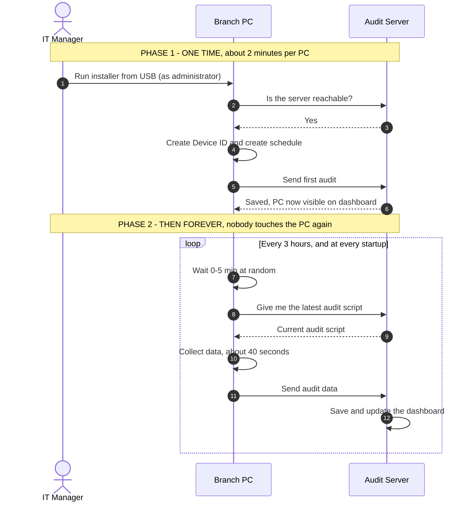
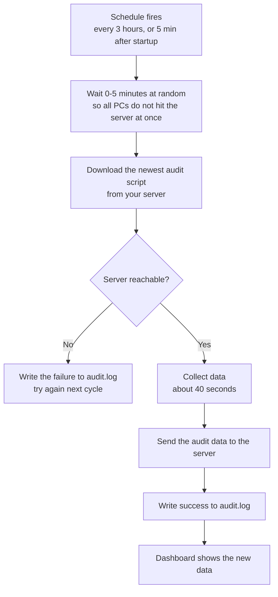

# Automatic Audit — Installation Guide

How to make every workstation audit itself automatically, every few hours,
without anybody running anything.

---

## 1. What changes

**Today**

> Someone must sit at the PC, open a terminal, and run the script by hand.
> One run = one scan. If nobody runs it, you get no data.

**After this setup**

> The PC audits itself every 3 hours, and every time it starts up.
> Nobody touches it again. Data keeps arriving on its own.

You visit each PC **once**, for about 2 minutes. That is all.

---

## 2. The big picture



**Key point:** the PC *pulls* the script from your server every single time.
So if you fix something on the server, every PC gets the fix automatically on
its next run. You never revisit the machines.

---

## 3. Before you start

You need:

| # | Item | Notes |
|---|------|-------|
| 1 | The audit server running | On a PC that stays switched on |
| 2 | The server's **network IP** | Not `localhost`, not `127.0.0.1` |
| 3 | A USB stick | With the `installer` folder copied onto it |
| 4 | Admin password for each PC | Windows: Administrator · Mac/Linux: sudo |

### How to find the server IP

Look at the audit server's startup message:

```
Network : http://192.168.1.45:8000
          ^^^^^^^^^^^^^^^^^^^^^^^^^  <-- this is what you need
```

> ⚠️ **Why not `localhost`?**
> `localhost` means "this same computer". The branch PC would look for the
> server *inside itself* and find nothing. It must be the network address.

---

## 4. Step 1 — Prepare the USB (do this ONCE)

1. Copy the whole **`installer`** folder onto the USB stick.

2. Open **`installer/config.txt`** in Notepad and fill it in:

```ini
SERVER_URL=http://192.168.1.45:8000        <- your server IP
INTERVAL_HOURS=3                            <- audit every 3 hours
JITTER_SECONDS=300                          <- leave as is
```

3. Save the file.

Only **one value** normally needs changing: `SERVER_URL`.

The USB is now ready for **every PC, in every branch**.

> ⚠️ Give the server a **fixed IP** first (DHCP reservation on the router, and
> a wired connection). If the server's IP changes, every installed PC stops
> reporting and has to be visited again.

---

## 5. Step 2 — Install on each PC

### 🪟 Windows

1. Plug in the USB, open the **`windows`** folder
2. **Right-click** `Install-Audit.bat` → **Run as administrator**
3. If a blue box says *"Windows protected your PC"*:
   **More info** → **Run anyway** *(normal for files from a USB)*
4. Wait for **SETUP COMPLETE**
5. Close the window, remove the USB

### 🍎 macOS

1. Plug in the USB, open the **`macos`** folder
2. **Right-click** `install-audit.command` → **Open**
   *(right-click "Open", **not** double-click — macOS blocks USB files otherwise)*
3. Enter the Mac password
4. Wait for **SETUP COMPLETE**

If macOS still refuses, open Terminal and run:

```bash
sudo bash /Volumes/<USB-NAME>/installer/macos/install-audit.command
```

### 🐧 Linux

1. Plug in the USB, open a Terminal
2. Go to the folder and run:

```bash
cd /media/$USER/<USB-NAME>/installer/linux
sudo bash install-audit.sh
```

3. Wait for **SETUP COMPLETE**

---

## 6. What the installer does (behind the scenes)

You do not need to do any of this — it is automatic. Shown so you know what
happened on the machine:

| Step | What happens | Why it matters |
|------|--------------|----------------|
| 1 | Checks admin rights | A schedule cannot be created without them |
| 2 | Reads `config.txt` | Gets the server address and schedule |
| 3 | **Tests the server connection** | Fails early with a clear message instead of installing something broken |
| 4 | Creates a **Device ID** | A permanent name for this PC, e.g. `dev_92ad241d47d8` |
| 5 | Installs a small runner script | Downloads + runs the audit each time |
| 6 | Creates the schedule | Every 3 hours + at startup |
| 7 | **Runs the first audit now** | The PC appears on the dashboard immediately |

### Why the Device ID matters

The old way used a `client_id` from the browser session — a new random value
every time. An automatic schedule has no browser.

The Device ID is created once and saved on the PC's disk. Every future audit
sends the same ID, so the server knows *"this is the same machine as before"*
and can keep its history and show changes over time.

Re-running the installer keeps the same ID, so **history is never broken**.

---

## 7. Step 3 — Check it worked

On the audit server:

1. Open the dashboard
2. Go to **Device Audits**
3. Click **🔄 Refresh Devices**
4. The PC should be listed with today's date and time ✅

If it is not there → see **Problems** below.

---

## 8. What happens from now on

Every 3 hours, and 5 minutes after every startup:



Nobody is logged in? Still works — it runs as SYSTEM / root.
PC was switched off? It runs shortly after the next startup.
Server unreachable? It logs the failure and tries again next cycle.

---

## 9. Where everything lives

| | Windows | macOS | Linux |
|---|---|---|---|
| Folder | `C:\ProgramData\NSDLAudit\` | `/Library/Application Support/NSDLAudit/` | `/var/lib/nsdl-audit/` |
| Log file | `audit.log` | `audit.log` | `audit.log` |
| Device ID | `device.id` | `device.id` | `device.id` |
| Schedule | Task Scheduler → *NSDL Compliance Audit* | `com.nsdl.audit` LaunchDaemon | `nsdl-audit.timer` |

### Check the schedule exists

```powershell
# Windows
schtasks /Query /TN "NSDL Compliance Audit"
```
```bash
# macOS
sudo launchctl list | grep nsdl

# Linux
systemctl status nsdl-audit.timer
```

### Force an audit right now (for testing)

```powershell
# Windows
schtasks /Run /TN "NSDL Compliance Audit"
```
```bash
# macOS
sudo launchctl kickstart -k system/com.nsdl.audit

# Linux
sudo systemctl start nsdl-audit.service
```

---

## 10. Problems and fixes

| Message / symptom | Cause | Fix |
|---|---|---|
| `Cannot reach <server>` | Wrong IP, server off, or different network | On the PC, open the `SERVER_URL` in a browser. You should see the dashboard. If not, fix that first |
| `must run as Administrator` | You double-clicked instead of right-clicking | Right-click → **Run as administrator** |
| Mac won't open the file | macOS quarantines files from USB | Right-click → **Open** (not double-click), or use the `sudo bash` command |
| `Windows protected your PC` | SmartScreen, normal for USB files | **More info** → **Run anyway** |
| Installed fine, but PC not on dashboard | Audit ran but upload failed | Open the log file (see section 9) — the last lines show the reason |
| Nothing in the log at all | Schedule was not created | Check the schedule exists (section 9). Re-run the installer |

---

## 11. Removing it from a PC

| OS | Command |
|---|---|
| Windows | Right-click `uninstall-audit.ps1` → **Run with PowerShell** (as admin) |
| macOS | Right-click `uninstall-audit.command` → **Open** |
| Linux | `sudo bash uninstall-audit.sh` |

This removes the schedule and all local files.
**Audits already sent to the server are not deleted.**

---

## 12. ⚠️ Important — do this on the server FIRST

Right now the server saves **3 files** (JSON + PDF + XML) and **1 database row**
for *every single upload*.

With automatic audits that becomes:

| | Per day | Per year |
|---|---|---|
| 100 PCs × 8 runs/day | 800 uploads | 292,000 |
| Files created | **2,400** | **876,000** |
| Disk used | ~45 MB | **~16 GB** |

**The disk will fill up.**

Most of the time nothing on a PC has changed. So the server should compare each
new audit with the previous one:

- **Nothing changed** → just update "last seen". Save nothing.
- **Something changed** (new software, new printer) → save it properly.

That reduces it to roughly **240 files/day** instead of 2,400.

> 🛑 **Do not start installing on many PCs until this is done on the server.**
> Otherwise you will be cleaning up hundreds of thousands of files afterwards.

---

## 13. Quick summary

```
ONCE:      edit config.txt on the USB
PER PC:    run the installer as admin  -> 2 minutes -> done forever
CHECK:     dashboard -> Device Audits -> Refresh Devices
AFTER:     PC audits itself every 3 hours, on its own
```
